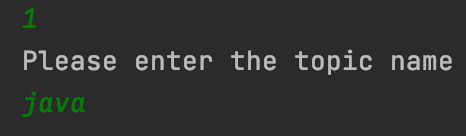
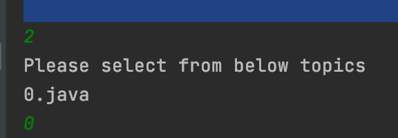
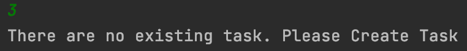
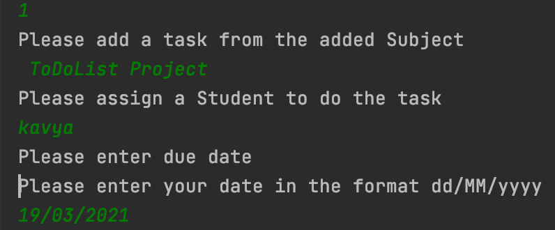
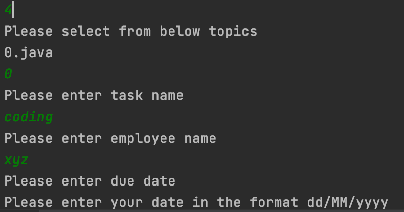
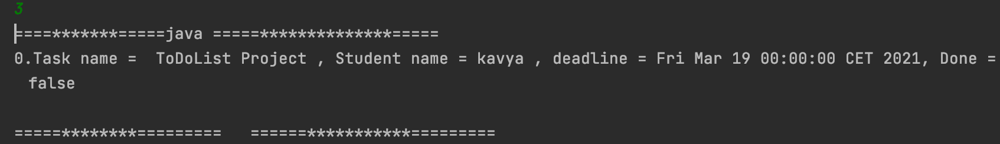

# ToDoList Project
In this ToDoList project you can be able to add, select,create,& assign due date.

## Getting started
This project can be run directly via Gradle or via a generated Jar file.

### Run with Gradle
In the root folder,start the application with Gradle's run command
...bash
gradle run --console plain

### Tools
*IntelliJ IDEA
*Eclipse

## usage

First run the Main.java 
...bash
 In the console, will get the output of the program like this

1. Add a topic
2. Choose a Topic from the List 
3. Display

4. Quit
   
###
...Below screenshot shows what happens if the user select '1'.
###
.
###
...So It will ask to enter the topic.
(You can see after adding the topic -> topic added successfully) 

###
...Next Screenshot shows, by selecting "2" It'll show the Subject(what the user added in a topic).
###

###
...Later selecting '2' from the above list it will give an option to th user that. 
###
...selecting '1' in the list : the user can add a task to the subject (ex:coding/reading),user can assign 
a task,and due date (Note:Follow the date format otherwise it will throw an exception error).
###
...selecting '2'in the list :  will show the user like what are the topics available in the list 
...(You can see from the below screenshot)
###

###

###

### 
...selecting '3' from the first list : will display what the user has created a ToDoList.
###
You can see from the below screenshot 
###

... Lastly, by selecting '4' (ie quit)  user will quit.

## Class Diagram
